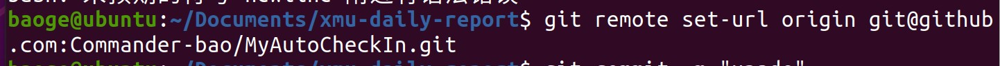

# git push 总结
## 首先转到你要push的文件夹
## 然后使用git init将其变成可管理的git仓库
## 用git remote add origin （复制你仓库的ssh方式）

## 使用git add将你想push的文件add进来

## 用命令git commit告诉Git,把文件提交到仓库,引号里的内容是本次提交的说明

## 最后使用git push -u origin master

## 恭喜你,成功了

## 当一个文件夹已经接上了一个git仓库之后怎么切换成另一个呢？

## 不成功？
### 1.仓库不要设置仓库保护
### 2.记得创建仓库的时候不要初始化
